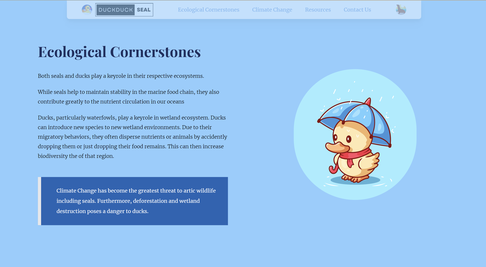

 #  🦆 🦆 **DUCK DUCK SEAL** 🦭

## Deploy
[View the deploy to see the animations]()

## Overview
This site was created to help me learn NextJS and also show my appreciation for ducks and seals :)

## Technologies
- The layout for this site was designed using figma
- NextJS
- Framer motion
- SwiperJS

## Screenshots

## Assets
Duck and seal images are created by [catalyststuff](https://www.freepik.com/author/catalyststuff) and [mamewmy](https://www.freepik.com/author/mamewmy)